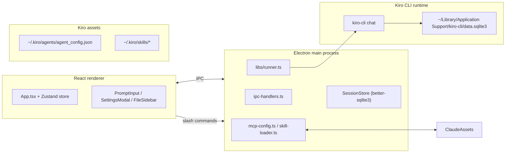
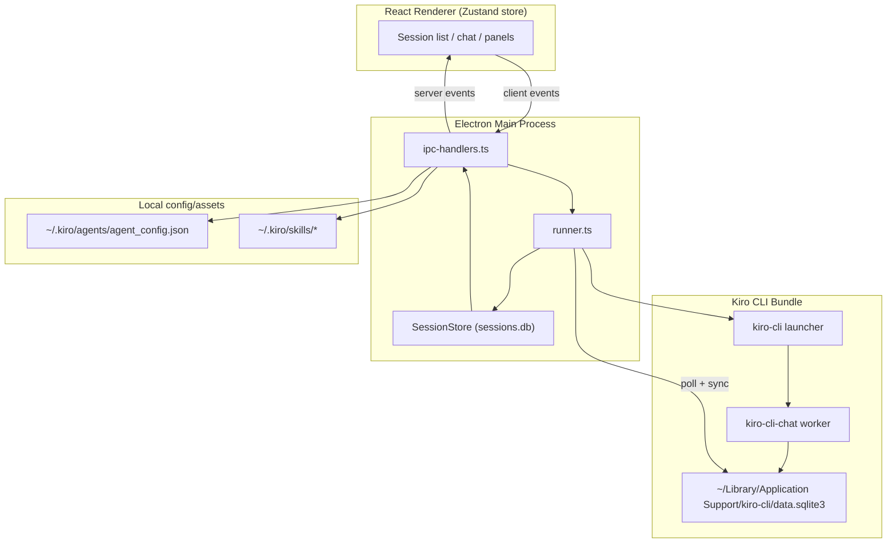
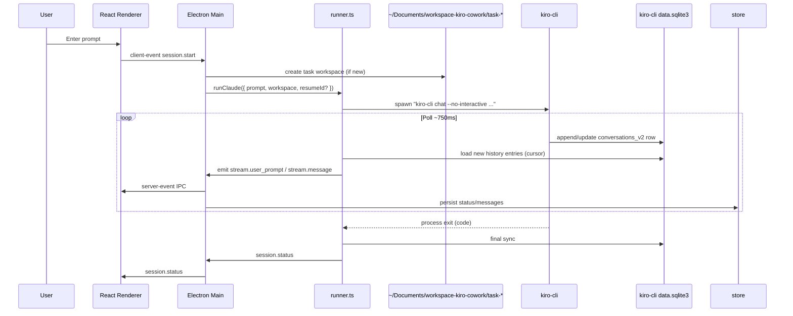
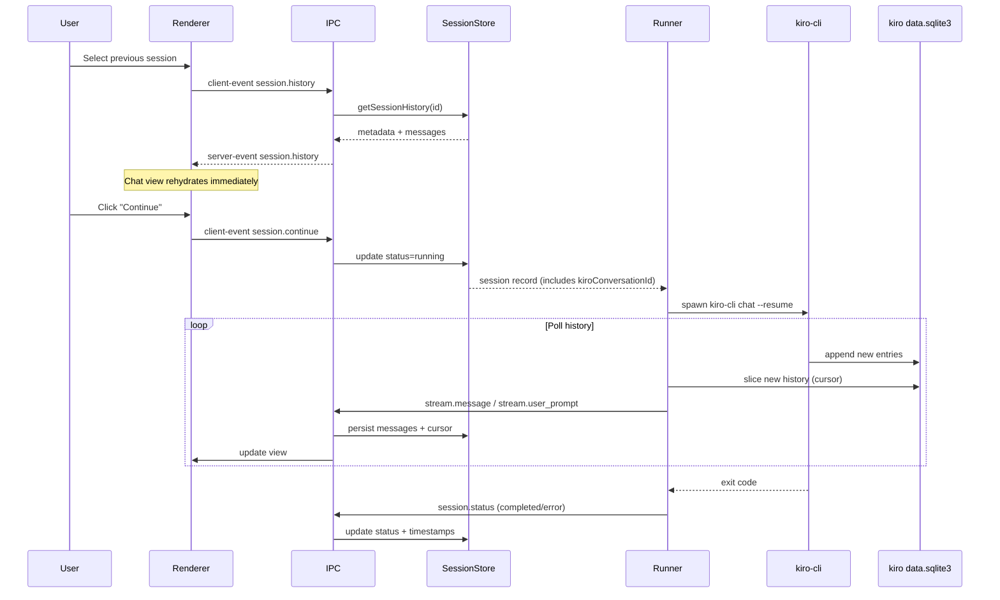
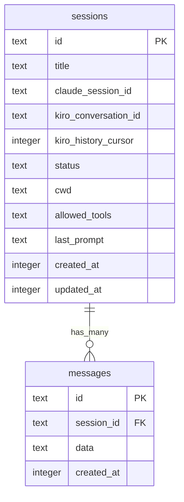

# Building Kiro Cowork as a fork of Agent Cowork

## Stack Snapshot

- **Electron main** (`src/electron/main.ts`, `src/electron/ipc-handlers.ts`) boots the `BrowserWindow`, wires IPC handlers, proxies file operations, fans out renderer events, and publishes desktop-only helpers like `copy-files-to-cwd`, `run-kiro-command`, `get-skills`, and MCP persistence.
- **Runner + Kiro adapters** (`src/electron/libs/runner.ts`, `kiro-cli.ts`, `kiro-conversation.ts`, `kiro-message-adapter.ts`) discover the `kiro-cli` binary, spawn `kiro-cli chat ...`, read Kiro’s SQLite conversation store, and translate raw history rows into the `AgentMessage` schema consumed by the renderer.
- **React renderer** (`src/ui/**/*`) is a Vite-powered React app with a single Zustand store that renders the session list, prompt bar, file viewers, the MCP/skills modal, and command results. It talks to Electron exclusively through the typed bridge in `src/electron/preload.cts`.
- **Persistence** lives in two SQLite databases: `SessionStore` (`src/electron/libs/session-store.ts`) keeps Cowork’s metadata/history in `app.getPath("userData")/sessions.db`, while `kiro-cli` maintains the authoritative conversation log inside `~/Library/Application Support/kiro-cli/data.sqlite3` (macOS path; Windows/Linux paths are resolved in `kiro-cli.ts`).
- **Kiro settings** provide MCP + skill metadata. `mcp-config.ts` reads/writes `~/.kiro/agents/agent_config.json`, while `skill-loader.ts` enumerates directories inside `~/.kiro/skills`.
- **Residual Claude Agent SDK usage** is limited to `generateSessionTitle()` in `src/electron/libs/util.ts`, which still calls `unstable_v2_prompt()` to suggest a title. The SDK no longer drives the agent runtime.

## High-Level Overview

Electron main is the sole process that talks to the OS. It launches `kiro-cli`, polls the conversation database, normalizes events, and streams them to the renderer. React never shells out directly; it emits typed events (`session.start`, `session.continue`, `runKiroCommand`, etc.) that the preload bridge forwards to main.

### End-to-End Component Diagram

## Runtime Lifecycle

1. **Session creation** – `session.start` triggers `SessionStore.createSession()`. If no `cwd` exists (new task), `workspace.ts` provisions `~/Documents/workspace-kiro-cowork/task-<timestamp>` and stores it in the session so Kiro CLI runs in an isolated folder.
2. **Running Kiro** – `runClaude()` resolves the `kiro-cli` binary (`KIRO_CLI_PATH`, `/Applications/Kiro CLI.app`, `/Applications/Kiro.app`, then `$PATH`) and spawns `kiro-cli chat --no-interactive --trust-all-tools --wrap never`. If the session already knows a `kiroConversationId`, `--resume` is added so Kiro reuses that conversation.
3. **Conversation sync** – while the CLI runs, we poll Kiro’s SQLite database for new `conversations_v2` history rows and convert them into `StreamMessage`s (`convertKiroHistoryEntries`). Each event is immediately forwarded to the renderer and stored in `sessions.db`.
4. **Status updates** – when the CLI exits, we do a final sync and emit `session.status`. Any error also emits `runner.error` so the renderer can surface it.
5. **Continuation** – `session.continue` reuses the stored workspace and `kiroConversationId`, so Kiro CLI resumes the correct conversation inside that directory.

> **Implication:** streaming fidelity depends on polling. If we disabled the poller, the UI would only update after the CLI exits, but with polling the renderer gets near real-time updates.

### Conversation synchronization & history cursors

- `SessionStore` now stores `kiro_conversation_id` and `kiro_history_cursor`. We optimistically populate them when `convertKiroHistoryEntries` sees new messages so the next run can resume without rereading the full history.
- The conversation key we query with is the normalized working directory. `loadKiroConversation()` opens `~/Library/Application Support/kiro-cli/data.sqlite3` (macOS), `%APPDATA%\kiro-cli\data.sqlite3` (Windows), or `~/.kiro-cli/data.sqlite3` (Linux) and fetches `select ... from conversations_v2 where key = ?`.
- Each history entry contains `user`, `assistant`, and `request_metadata` blobs. `kiro-message-adapter.ts` maps them to Cowork’s `AgentMessage` schema, synthesizing UUIDs when Kiro omitted them.
- `resolveKiroCliBinary()` (in `kiro-cli.ts`) locates the CLI binary across platforms (environment override, `/Applications` bundle, PATH lookup). This keeps `runner.ts` agnostic to OS details, and we update it whenever the install layout changes.
- `loadKiroConversation()` (in `kiro-conversation.ts`) opens Kiro’s SQLite database in read-only mode and fetches the `conversations_v2` row for the active working directory. It’s the single source of truth for chat history, which is why both the streaming poller and the final sync call it.
- `convertKiroHistoryEntries()` (in `kiro-message-adapter.ts`) takes the raw history array from `conversations_v2.value` and emits Cowork’s internal `StreamMessage` objects (user prompts, tool uses, assistant text, etc.). This adapter lets the renderer stay decoupled from Kiro’s JSON schema.

> **How "streaming" works**  
> Instead of reading the SQLite log once at the end, Cowork now polls `~/Library/Application Support/kiro-cli/data.sqlite3` about twice per second while the CLI process runs. Each poll slices off any new history entries and forwards them immediately, which gives near-real-time updates even though we still rely on the DB as the source of truth. If the polling ever causes issues we can revert by removing the interval and returning to the previous “sync only on exit” implementation in `runner.ts`.

## Build Footprint

Electron apps always bundle a full Chromium runtime and Node.js, so even small code changes ship inside a ~400–500 MB `.app`/`.dmg`. The bulk of the size comes from:

- The Electron runtime itself (~250 MB).
- All runtime dependencies in `node_modules` (better-sqlite3 native bindings, React, Radix UI, etc.).
- The `@anthropic-ai/claude-agent-sdk` package, which includes the entire Claude Code CLI.
- Static assets and compiled React/Vite output.

In other words, our own logic only touches a handful of TypeScript files, but the package still contains the full browser+Node runtime. Deploying a new version therefore means copying the whole bundle and (optionally) backing up the previous `.app` before replacing it.

### Workspace management

- `workspace.ts` ensures `~/Documents/workspace-kiro-cowork` exists when the app boots.
- Every new session auto-creates a unique subdirectory (`task-YYYYMMDD-HHMMSS[-NN]`) under that root and uses it as `cwd` for all `kiro-cli` invocations, so conversations never clash even if tasks relate to the same project.
- The UI no longer lets users select arbitrary folders; instead they upload any required assets and Cowork copies them into the session workspace.
- Older sessions created before this change continue using their original directories; the automatic workspace allocation only applies to newly created sessions.

### CLI invocation & inputs

- `runClaude()` spawns `kiro-cli chat --no-interactive --trust-all-tools --wrap never --model <...> --agent <...> [--resume] "<prompt>"`. By default the model is `claude-opus-4.5` and the agent profile is `kiro-coworker`, but you can override them via `KIRO_DEFAULT_MODEL` / `KIRO_AGENT`. `--resume` is included only when we have a stored conversation ID for that directory.
- Environment variables (`KIRO_DEFAULT_MODEL`, `KIRO_AGENT`, plus the enhanced PATH) control model/agent defaults. Users override them before launching Coworker if needed.
- Slash commands and uploads operate on the session workspace: slash commands shell out to the same directory, and uploads copy files into that folder so Kiro sees them.
- Kiro CLI writes its entire conversation history into a single row per workspace (`~/Library/Application Support/kiro-cli/data.sqlite3`, table `conversations_v2`). The `history` array grows with each tool call/result. Coworker keeps a cursor (`kiroHistoryCursor`) and on each poll slices `history[cursor:]`, converts the new entries, and forwards them to the renderer.
- You can inspect the raw log manually via `sqlite3 ~/Library/Application\ Support/kiro-cli/data.sqlite3` and `SELECT key,value FROM conversations_v2 WHERE key='<workspace path>'`.
- Polling works the same in both CLI modes; the only impact of the interactive toggle is whether we append `--no-interactive` (automatic exit) or leave the CLI running until you click “Stop”.
- Why not parse stdout directly? Unlike the Claude SDK, Kiro CLI does not emit a JSON protocol on stdout—the output is meant for humans. Scraping that text would be brittle, so we rely on the structured SQLite log instead. If Kiro exposes a streaming SDK in the future we can drop the poller.

### Session resumption

- `session.continue` refuses to run if the store does not have a `kiroConversationId`. New sessions therefore require at least one successful run so Kiro can write the row we later resume from.
- On continue requests, we call `runClaude()` with the stored `kiroConversationId`. Today the CLI flag is a bare `--resume`, so Kiro determines which conversation to load based on its own metadata for the working directory.
- Stopping a session (`session.stop`) SIGINTs the child process and marks the session as `idle`; there is no partial flush of the conversation log until Kiro writes again.

### Reopening an Existing Session

This flow allows a reopened session to display historical messages instantly (from `sessions.db`) while new responses stream in as kiro-cli writes them.

## Kiro CLI Integration Details

### Binary discovery & environment enrichment

`resolveKiroCliBinary()` checks `KIRO_CLI_PATH`, `/Applications/Kiro CLI.app`, `/Applications/Kiro.app`, and finally looks up `kiro-cli` (`kiro-cli.exe` on Windows) on the user’s PATH. If nothing is found we emit `runner.error` and fail fast.

`enhancedEnv` (in `src/electron/libs/util.ts`) prepends Homebrew, bun, `.local/bin`, nvm/fnm/volta shims, `/usr/local/bin`, `/usr/bin`, etc. to PATH. Every CLI invocation adds `NO_COLOR=1`, `CLICOLOR=0`, and `KIRO_CLI_DISABLE_PAGER=1` to keep the output machine-friendly.

Cowork passes `--model <ID>` and `--agent <name>` to every `kiro-cli chat` invocation. The defaults are `claude-sonnet-4.5` and `kiro-coworker`, but you can override them by exporting `KIRO_DEFAULT_MODEL` and/or `KIRO_AGENT` before launching the app (e.g., `KIRO_DEFAULT_MODEL=claude-opus-4.5 KIRO_AGENT=my-profile bun run dev`).

> **Why do I see both `kiro-cli` and `kiro-cli-chat` in `ps`?**  
> The `kiro-cli` binary is a lightweight launcher that resolves the agent profile and spawns the actual conversation engine (`kiro-cli-chat`). When Cowork starts a session the OS therefore shows two processes: the launcher (`kiro-cli …`) and the runtime worker (`kiro-cli-chat …`). Both carry the same flags and exit when the session completes.
>
> **Why do we pass `--no-interactive`?**  
> All Cowork runs are non-interactive: the user approves/denies tools via the UI, not via the CLI prompt. `--no-interactive` disables Kiro’s REPL/pager so the child process never waits on stdin; it’s orthogonal to streaming.
>
> **Does every prompt relaunch the CLI?**  
> Yes. Each prompt spawns a new `kiro-cli chat … "<prompt>"` process. We persist the `conversation_id`/cursor in `sessions.db`, so when the next prompt arrives we spawn another process with the same working directory and `--resume`. Kiro looks up “latest conversation for this directory” and continues it automatically.
>
> **Which session does `--resume` pick?**  
> The working directory is the key. Kiro’s SQLite log stores one `conversations_v2` row per normalized path. `--resume` simply loads the most recent conversation for the `cwd` we pass; there’s no explicit session ID in the CLI today.
>
> **What if I start multiple tasks in the same directory?**  
> Kiro will treat them as the same conversation because `cwd` collides. We still keep separate rows in our own `sessions.db`, but Kiro sees only one conversation record per directory, so both runs will resume/append to the same history.
>
> **How can I isolate tasks that share a codebase?**  
> Today the only workaround is to give each task a unique working directory (real folder, symlink, or copy) or manually reset/delete the conversation in Kiro before starting a new task. Kiro CLI doesn’t yet expose a `--conversation-id` flag we could use to force isolation.

### Command invocation & slash commands

- Prompt submissions spawn `kiro-cli chat` with the prompt appended as the last argument.
- Slash commands (textareas starting with `/`) never touch the runner. `PromptInput` calls `window.electron.runKiroCommand({ cwd, command })`, which shells out to the same binary with arbitrary arguments so `/status`, `/context`, etc. behave like the official CLI.
- The Settings modal reuses this facility indirectly through `run-npx-install` (generic shell command within the selected working directory) and provides a separate `/skills` runner (`run-skills-cli`) that still shells out to `claude --print --setting-sources user,project --allowedTools Skill "/skills"` until Kiro ships an equivalent summary.

### Conversation metadata & support directories

`kiro-cli.ts` can also locate:

- the support directory (macOS `~/Library/Application Support/kiro-cli`, Windows `%APPDATA%\kiro-cli`, Linux `~/.kiro-cli`),
- the persistent conversation DB (`data.sqlite3`),
- the log directory (`$TMPDIR/kiro-log` or a custom `KIRO_LOG_DIR`),
- and the socket directory (`$TMPDIR/kirorun`).

We only read the DB today, but the helper centralizes discovery so future features can tail logs or inspect sockets without reimplementing platform-specific paths.

## MCP & Skills Surfaces

- **MCP config** – `loadKiroMcpServers()`/`setKiroMcpServerDisabled()` read and write `~/.kiro/agents/agent_config.json`. The Settings modal lists every entry from that file and lets you flip the `disabled` flag without touching a terminal; structural edits still happen via Kiro CLI or by editing the JSON file directly.
- **Skill discovery** – `skill-loader.ts` enumerates directories inside `~/.kiro/skills`. There is no SKILL.md parsing—the modal simply lists folder names with quick links to open them in Finder.

## Renderer & IPC Contract

The preload script (`src/electron/preload.cts`) exposes:

- **Session control** – `sendClientEvent`, `onServerEvent`, `generateSessionTitle`, `getRecentCwds`.
- **Filesystem** – `readFile`, `fileExists`, `select-directory`, `select-files`, `copy-files-to-cwd`, `openFileExternal`, `openExternalUrl`.
- **Kiro bridges** – `runKiroCommand`.
- **MCP & skills** – `getKiroMcpServers`, `setKiroMcpServerDisabled`, `getSkills`.
- **Diagnostics** – `getStaticData`, `subscribeStatistics`.

All payloads are typed in `types.d.ts` and mirrored in `src/ui/types.ts`, so renderer code stays type-safe.

The renderer is responsible for:

- Maintaining the single source of truth via Zustand (`useAppStore.ts`). It aggregates command results, permission requests (placeholder for future implementations), file metadata, and session history.
- Presenting history fetched via `session.history`, including tool cards, transcripts, file trackers, and command outputs.
- Computing the “effective CWD” (`useEffectiveCwd.ts`) so slash commands and uploads default to the current session’s directory if the manual field is empty.
- Handling uploads (`PromptInput` + paperclip) by asking the main process to copy files into the workspace and surfacing the result inline.

## File Handling & Uploads

`read-file` in `main.ts` supports:

- Text formats (`.ts`, `.py`, `.md`, etc.) – return inline content.
- Images – base64-encode for embedding.
- PDF – return the path for browser rendering.
- Excel (`xlsx`, `xlsm`, etc.) – parse via `xlsx` into JSON so the renderer can show sheets.
- PowerPoint – decompress via `yauzl` and extract slide text.
- Binary fallbacks – mark as non-previewable and offer “open externally.”

Uploads go through `copy-files-to-cwd`, which deduplicates filenames, copies files with collision-safe suffixes, and returns both successes and failures so the renderer can provide granular feedback.

## Persistence Layout

- `SessionStore` lives in `app.getPath("userData")/sessions.db` (WAL mode). It mirrors every `stream.message` / `stream.user_prompt` the runner emits so history survives restarts.
- Conversation bodies never live in Cowork’s DB; we always rehydrate from the Kiro SQLite store and drop stitched messages into our own history table.
- Each message row stores the serialized JSON payload. The UI replays them verbatim when the user opens a historic session.
- The session/talk list you see in the UI is sourced from the `sessions` table via `SessionStore.listSessions()`, ordered by `updated_at DESC`. Each row tracks its own title, status, working directory, and cursor, so different tasks under the same directory never overwrite each other—they simply become separate session rows.
- Kiro CLI and the Electron app use **two separate SQLite files**:
  - `~/Library/Application Support/kiro-cli/data.sqlite3` (written exclusively by `kiro-cli`/`kiro-cli-chat`). We poll it to discover new history entries; we never write to it.
  - `<userData>/sessions.db` (managed by `SessionStore`). We write session metadata and the streamed messages there so the UI can reopen conversations offline.
- We do **not** parse STDOUT directly. Instead, `runner.ts` polls Kiro’s SQLite history and pushes any new entries to the renderer. This makes the UI behave like a stream even though we rely on the DB as the source of truth.
- Inputs to Kiro CLI are passed via the spawn arguments/environment (e.g., `kiro-cli chat --model … --agent … "<prompt>"`). Slash commands go through `runKiroCommand` which shells out in the same way; stdin is not used.

## Security Considerations

- **Process privileges** – `kiro-cli` inherits the user’s permissions. There is no sandbox, so selecting a directory with sensitive files grants the agent full access to it.
- **Auto approvals** – `--trust-all-tools` means the CLI never asks the renderer for permission. This mirrors running `kiro-cli chat --trust-all-tools` manually but removes the safety net the old Claude SDK provided. Future work could reintroduce granular approvals by parsing tool events ourselves.
- **Slash commands** – `/whatever` literally shells out to the CLI inside the selected directory. Malformed commands can delete files or hang; we only guard against empty input.
- **MCP editing** – Toggling servers writes directly into `~/.kiro/agents/agent_config.json`. We validate the payload shape but cannot guarantee the downstream CLI accepts it.
- **Uploads** – Files are copied into the workspace with no additional scanning or sandboxing.
- **External links** – Renderer navigation is restricted to `http(s)` and `mailto`, but once a link opens in the browser it behaves normally.

## Residual Claude SDK Usage

Although Kiro CLI now drives every session, we still depend on `@anthropic-ai/claude-agent-sdk` for one feature: generating session titles. `generateSessionTitle()` calls `unstable_v2_prompt()` with the user’s first prompt and the enriched environment/path to produce a concise label. If the SDK fails we fall back to `"New Session"`. Removing this dependency would require us to either call an HTTP API directly or ask Kiro CLI for a similar helper.

---

This document reflects the post-port reality: Kiro CLI is the runtime, Cowork orchestrates it, and Kiro’s own settings directory (`~/.kiro`) is the bridge for MCPs and skills (while `~/.claude/settings.json` still feeds legacy environment variables).
