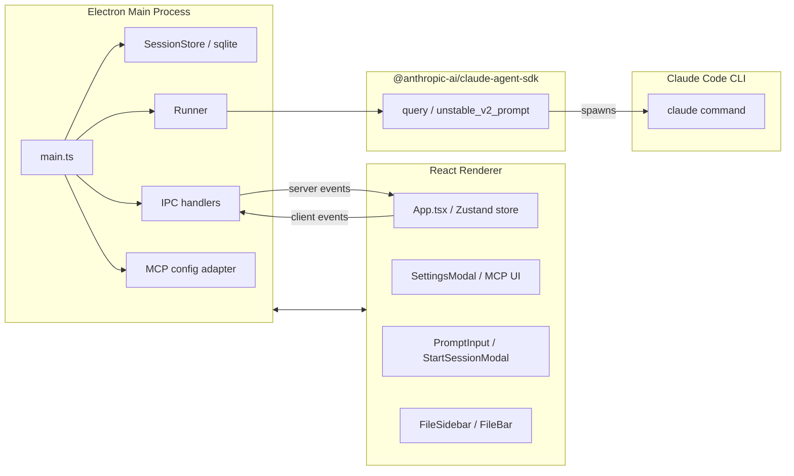
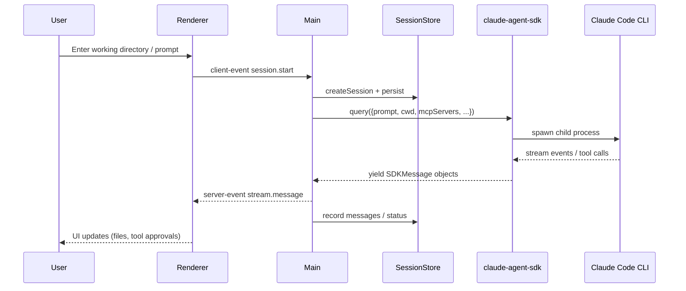
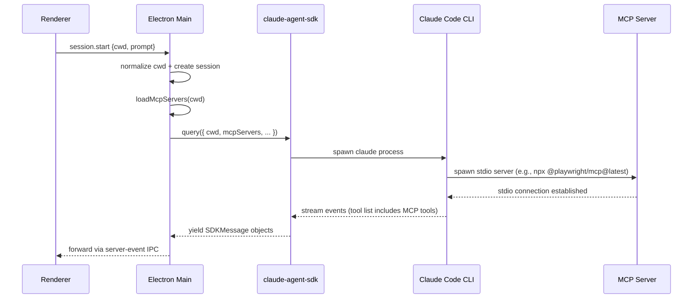
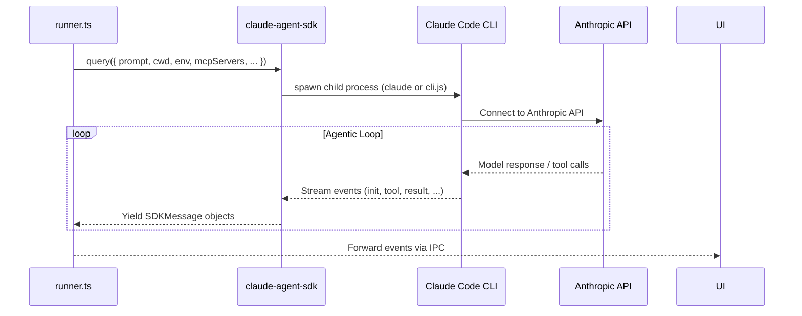
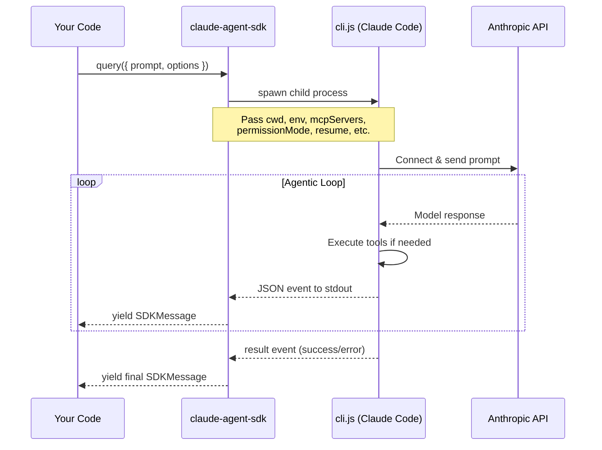
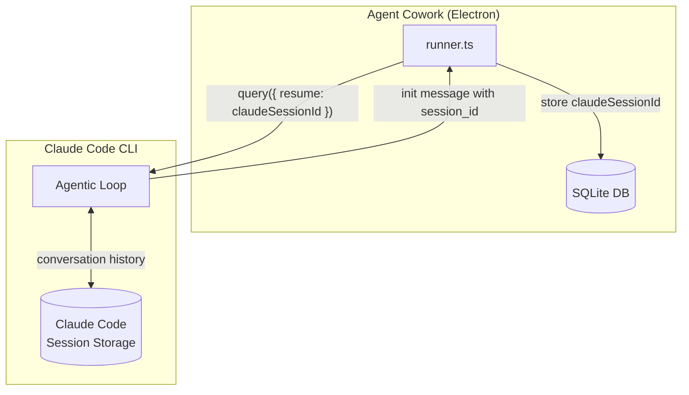
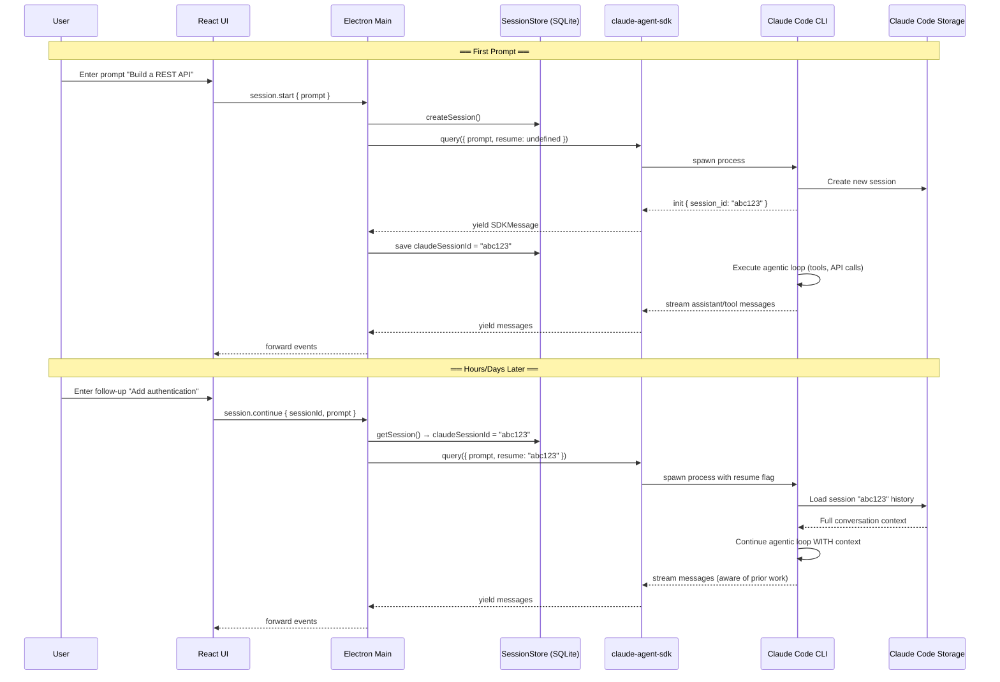
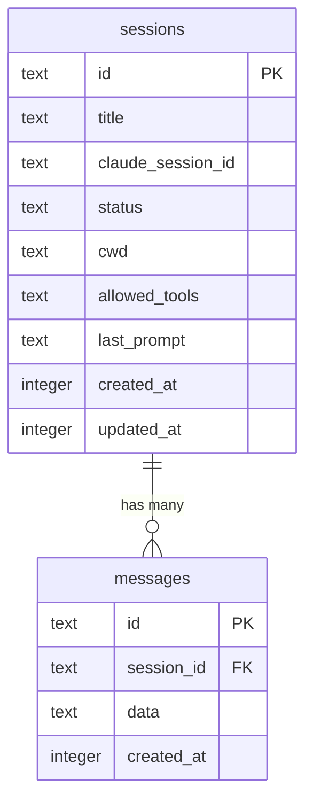

# Agent Cowork Architecture

## High-Level Overview



* **Electron main process (`src/electron/main.ts`)** – bootstraps the BrowserWindow, handles dialog/file access, exposes IPC APIs, manages session persistence, and acts as the gateway to Claude Code.
* **React renderer (`src/ui`)** – Zustand store + components for sessions, prompts, MCP settings, file previews, etc. Communicates exclusively over the typed IPC surface defined in `types.d.ts`.
* **Claude Agent SDK (`@anthropic-ai/claude-agent-sdk`)** – a Node.js library that provides programmatic control over Claude Code CLI. Exposes `query()` for streaming conversations and `unstable_v2_prompt()` for one-shot prompts.
* **Claude Code CLI** – the actual agentic runtime. The SDK spawns it as a child process. In dev mode it uses the `claude` command from PATH; in production builds it uses the bundled `cli.js` from the SDK package.
* **SQLite persistence (`SessionStore`)** – retains session metadata/messages so the desktop app can resume and display history.

## Lifecycle



### Key flows

1. **Working directory selection**  
   The user sets a directory in `StartSessionModal`. It is normalized and stored both in the Zustand state (`cwd`) and in the `SessionStore` row.

2. **Session start**  
   When the user submits a prompt, `PromptInput` emits `session.start`. Electron creates a new session, updates SQLite, and launches `runClaude`.

3. **Claude Code execution**  
   `runClaude` (in `libs/runner.ts`) calls the SDK's `query()` function with:
   * `prompt`: the user's input text
   * `cwd`: the normalized working directory (fallback to `process.cwd()` if empty)
   * `env`: enriched PATH (bun, Homebrew, `.local/bin`, nvm/fnm/volta Node versions)
   * `pathToClaudeCodeExecutable`: in production, points to `cli.js` bundled inside the SDK package; in dev mode it's `undefined` so the SDK uses the `claude` command from PATH
   * `mcpServers`: loaded from the project entry in `~/.claude.json`
   * `permissionMode: "bypassPermissions"` + `canUseTool` callback: auto-approves most tools but forwards `AskUserQuestion` events to the renderer for interactive user approval

4. **Streaming + persistence**  
   Each SDK event is forwarded to the renderer and recorded in SQLite via `SessionStore.recordMessage`. File creation/access events are heuristically extracted for the FileBar/FileSidebar.

5. **MCP configuration**  
   `SettingsModal` calls the IPC endpoints `get-mcp-servers` / `save-mcp-servers`, which read/write the relevant project block in `~/.claude.json`. A built-in “Run command” panel executes any `claude mcp …` command inside the selected working directory, keeping the desktop app and CLI in sync.

## Detailed Components

### IPC Surface

* `getStaticData`, `statistics` – system metrics for the sidebar.
* `generate-session-title` – invokes Claude Code to suggest a title.
* `session.*` events – drive the session lifecycle (start, continue, stop, delete).
* `read-file`, `open-file-external`, `file-exists` – used by the File sidebar (text/Image/PDF/Excel/PPT support).
* `get-mcp-servers`, `save-mcp-servers`, `run-npx-install` – MCP settings management.

All IPC payloads are defined in `types.d.ts` and enforced on both sides (TypeScript + preload layer).

### MCP Integration

1. **Storage** – Agent Cowork mirrors Claude Desktop by storing per-project config inside `~/.claude.json`. Keys are normalized absolute paths (e.g., `/Users/girpatil/Documents/Coding/Papers_To_Analyze`). Both stdio (`type: "stdio", command: …, args, env`) and HTTP servers (`type: "http", url, headers`) are preserved verbatim—no assumptions about transport are made.
2. **UI Management** – The Settings modal reads either the manually set working directory or the active session cwd. Users can:
   * Add/edit/remove entries via the form (stdio entries show command/args/env; HTTP entries show URL/headers).
   * Run `claude mcp …` commands via the built-in runner; stdout/stderr are shown inline.
3. **Runtime Injection** – `runClaude` calls `loadMcpServers(session.cwd)` and passes the returned object to the SDK's `mcpServers` option. Stdio entries become `{ type: "stdio", command, args, env }`. HTTP entries become `{ type: "http", url, headers }`. The SDK forwards these to the CLI, which spawns stdio MCP servers or connects to HTTP endpoints as needed.

#### When do MCP servers start?



MCP servers only spin up when a session begins; they aren't launched when Cowork boots or when you merely add/edit entries in Settings.

#### How does Cowork call Claude Code?

Agent Cowork does **not** call Claude Code CLI directly. Instead, it uses the `@anthropic-ai/claude-agent-sdk` package as an intermediary:



**Why this design?**
- The SDK provides a clean async iterator interface over the CLI's JSON output
- It handles process lifecycle, environment setup, and error handling
- Agent Cowork only needs to consume events and forward them to the UI

**Dev vs Production:**
- **Dev mode** – `pathToClaudeCodeExecutable` is `undefined`, so the SDK spawns whatever `claude` command is on your PATH (requires Claude Code CLI installed globally or via npm).
- **Packaged app** – `getClaudeCodePath()` returns `app.asar.unpacked/node_modules/@anthropic-ai/claude-agent-sdk/cli.js` inside the app bundle. The SDK package includes its own bundled CLI entry point.

Cowork doesn't reimplement any agent logic; it simply orchestrates the SDK with the selected working directory, environment, and MCP servers.

### File Uploads

The prompt bar includes a paperclip button that lets you select arbitrary files. When you pick files:

1. The renderer asks the OS for paths (`select-files` IPC).
2. The main process copies each file into the current working directory, adding suffixes if a name already exists.
3. A success/error message is shown under the prompt. Once copied, the files are part of the workspace so Claude’s tools (Bash, Read, etc.) can access them in the same session.

#### Understanding Claude Agent SDK vs Claude Code CLI

A common misconception is that "Claude Code is built with Claude Agent SDK." **This is incorrect** — the relationship is the reverse:

| Component | Role | Size |
|-----------|------|------|
| **Claude Code CLI** | The core agentic runtime — contains all logic for tool execution, file editing, MCP integration, and Anthropic API connection | ~11 MB (`cli.js`) |
| **Claude Agent SDK** | A Node.js wrapper library that spawns and controls Claude Code CLI programmatically | ~720 KB (`sdk.mjs`) |

**Key evidence:**

1. **The SDK bundles Claude Code**, not the other way around:
   ```json
   // node_modules/@anthropic-ai/claude-agent-sdk/package.json
   "claudeCodeVersion": "2.1.6"
   ```

2. **The SDK has an option to specify the CLI path** (`pathToClaudeCodeExecutable`), because it spawns Claude Code as a child process.

3. **The bundled `cli.js` is the full Claude Code CLI** (11 MB) compiled into a single JavaScript file.

```
┌─────────────────────────────────────────────────────┐
│  Claude Agent SDK (wrapper)                         │
│  ┌───────────────────────────────────────────────┐  │
│  │  Claude Code CLI (bundled as cli.js)          │  │
│  │  - Agentic loop                               │  │
│  │  - Tool execution (Bash, file edit, etc.)     │  │
│  │  - MCP server management                      │  │
│  │  - Anthropic API connection                   │  │
│  └───────────────────────────────────────────────┘  │
│                                                     │
│  SDK Layer (sdk.mjs):                               │
│  - Spawns CLI as child process                      │
│  - Parses JSON output from CLI                      │
│  - Exposes query() async generator                  │
│  - Handles abort/interrupt signals                  │
└─────────────────────────────────────────────────────┘
```

#### What does `query()` actually do?

The SDK bundles **Claude Code CLI version 2.1.6** as `cli.js` (an **11 MB** file). The `query()` function is the SDK's primary interface for interacting with it.

**Function signature:**

```typescript
// Signature from sdk.d.ts
export declare function query(_params: {
    prompt: string | AsyncIterable<SDKUserMessage>;
    options?: Options;
}): Query;

// Query extends AsyncGenerator
export declare interface Query extends AsyncGenerator<SDKMessage, void> {
    interrupt(): Promise<void>;
    setPermissionMode(mode: PermissionMode): Promise<void>;
    setModel(model?: string): Promise<void>;
    // ... other control methods
}
```

**When you call `query()`, the following happens:**

```
┌────────────────────────────────────────────────────────────────────────┐
│  1. SPAWN CHILD PROCESS                                                │
│     ─────────────────────                                              │
│     Either the bundled cli.js (~11 MB) or a custom path you provide    │
│     via pathToClaudeCodeExecutable option.                             │
│                                                                        │
│  2. PASS OPTIONS AS CLI ARGUMENTS/ENV                                  │
│     ──────────────────────────────────                                 │
│     Options like cwd, prompt, mcpServers, permissionMode, env,         │
│     resume (session ID), etc. are passed to the spawned process.       │
│                                                                        │
│  3. CLI RUNS THE AGENTIC LOOP                                          │
│     ──────────────────────────                                         │
│     Claude Code CLI connects to Anthropic API, executes tools,         │
│     manages MCP servers, and runs until completion or interruption.    │
│                                                                        │
│  4. STREAM JSON EVENTS TO STDOUT                                       │
│     ─────────────────────────────                                      │
│     The CLI outputs structured JSON events to stdout. Each event       │
│     represents a step in the conversation (init, assistant message,    │
│     tool use, tool result, final result, etc.)                         │
│                                                                        │
│  5. SDK PARSES AND YIELDS SDKMessage OBJECTS                           │
│     ─────────────────────────────────────────                          │
│     The SDK reads stdout, parses JSON lines, and yields typed          │
│     SDKMessage objects via the async iterator interface.               │
│     Your code consumes them with: for await (const message of q)       │
└────────────────────────────────────────────────────────────────────────┘
```



**How Agent Cowork consumes it:**

```typescript
// From runner.ts
const q = query({ prompt, options: { cwd, env, mcpServers, ... } });

for await (const message of q) {
    // message is an SDKMessage object
    // Types: system (init/result), assistant (text/tool_use), user (tool_result)
    sendMessage(message);  // Forward to React UI via IPC
}
```

**Message types yielded by `query()`:**

| Type | Subtype | Description |
|------|---------|-------------|
| `system` | `init` | Session started, contains `session_id` |
| `system` | `result` | Session ended (success or error) |
| `assistant` | — | Model response (text or tool_use blocks) |
| `user` | — | Tool results fed back to the model |

#### Who runs the tools? (Agentic Loop)

**Claude Code CLI runs the tools, NOT `runner.ts`.** The `runner.ts` file is a passive consumer that only:
1. Calls the SDK's `query()` function
2. Forwards streamed `SDKMessage` events to the UI

The entire agentic loop happens **inside Claude Code CLI**:

```
┌─────────────────────────────────────────────────────────┐
│  Claude Code CLI (the agentic loop)                     │
│                                                         │
│  1. Send prompt + context to Anthropic API              │
│  2. Receive model response (text + tool_use blocks)     │
│  3. Execute tools (Bash, file edit, MCP tools, etc.)    │
│  4. Collect tool results                                │
│  5. Send results back to model                          │
│  6. Repeat until model says "done"                      │
│                                                         │
│  ──► Stream events to stdout (JSON) ──►                 │
└─────────────────────────────────────────────────────────┘
                         │
                         ▼
┌─────────────────────────────────────────────────────────┐
│  runner.ts (passive consumer)                           │
│                                                         │
│  for await (const message of query(...)) {              │
│      sendMessage(message);  // forward to UI            │
│  }                                                      │
└─────────────────────────────────────────────────────────┘
```

#### Session Resumption and Context Persistence

When a user sends successive prompts in the same Agent Cowork session, **the same Claude Code session is resumed**, preserving the full conversation history. This works even after the app is closed and reopened, or days later.



**How session resumption works:**



**Key points:**

| Aspect | How it works |
|--------|--------------|
| **Session ID capture** | On first prompt, Claude Code returns `session_id` in init message. Agent Cowork saves this as `claudeSessionId`. |
| **Persistence** | `claudeSessionId` is stored in SQLite (`claude_session_id` column), surviving app restarts. |
| **Resumption** | On follow-up prompts, `resumeSessionId` is passed to `query()`, which tells Claude Code to load existing context. |
| **Context storage** | Claude Code CLI maintains its own session storage with full conversation history. |
| **Time independence** | Even days later, as long as `claudeSessionId` exists, the full context is retrieved and reused. |

**Code evidence:**

```typescript
// First prompt: capture session_id from init message (runner.ts:114-121)
if (message.type === "system" && message.subtype === "init") {
  session.claudeSessionId = message.session_id;
  onSessionUpdate?.({ claudeSessionId: sdkSessionId });
}

// Follow-up prompts: pass resume option (runner.ts:68-70)
const q = query({
  prompt,
  options: {
    resume: resumeSessionId,  // ← Tells Claude Code to continue this session
    // ...
  }
});
```

### File Handling

* Text-based files are read directly and streamed to the renderer.
* Binary assets: PDFs render via `file://` embed, images -> base64 data URLs, Excel/PPT are parsed into JSON for table/slide previews.
* FileBar segmentation (accessed vs created) is based on tool metadata + regex heuristics.

### Persistence



SQLite lives in `app.getPath("userData")/sessions.db` (WAL mode). `SessionStore` keeps an in-memory map plus persisting updates so the UI can render history instantly on launch.

## Security Considerations

**What exists now:**

* **Permission prompts** – Tool calls that require user input (`AskUserQuestion`) are forwarded to the renderer, and users must approve/deny.
* **Directory scoping** – Every Claude Code invocation is scoped to the user-selected working directory; this prevents accidental operations on arbitrary paths unless the user explicitly points Cowork there.
* **Enhanced PATH** – Controlled list of paths (Homebrew, bun, `.local/bin`, Node via nvm/fnm) to ensure predictable command resolution.

**What’s missing / to be aware of:**

* **No sandbox** – Once a working directory is selected, Claude Code has normal filesystem and network access within the OS permissions of the user account. There is no macOS sandbox or jailed execution environment.
* **No secrets redaction** – Files are read raw by the main process and could be streamed to Claude; users must rely on the built-in permission prompts and their own judgment when sharing sensitive data.
* **MCP commands run verbatim** – The “Run command” field executes whatever text is provided (`claude`, `npx`, etc.) in the selected directory. There is no validation beyond requiring a directory.
* **IPC trust boundary** – The preload script validates origins in dev/prod, but opening a malicious renderer window would still circumvent IPC restrictions.
* **Network operations** – Rely entirely on Claude Code’s internal controls. Cowork itself does not block HTTP requests or uploads.

## Adding New Features

1. **New MCP server**  
   * Add via Settings modal or `claude mcp add …` in the proper directory.
   * The session must run in the same directory for Claude Code to discover it.

2. **Additional IPC tools**  
   * Extend `types.d.ts` with the payloads.
   * Add `ipcMainHandle` wrappers in `main.ts`.

3. **Custom file previews**  
   * Extend the `read-file` handler with new MIME logic.
   * Update `FileSidebar` to render the new `fileType`.

4. **Security hardening** (future ideas)  
   * Add optional sandboxing (macOS app sandbox, or running Claude Code inside a restricted shell).
   * Allow per-session command allowlists/denylists.
   * Support read-only modes for working directories.

---

For day-to-day development, `bun run dev` starts both Vite and Electron with hot reload. Production builds are created via `bun run dist:mac|win|linux`, which transpiles the Electron code, builds the React UI, and packages everything with electron-builder.
