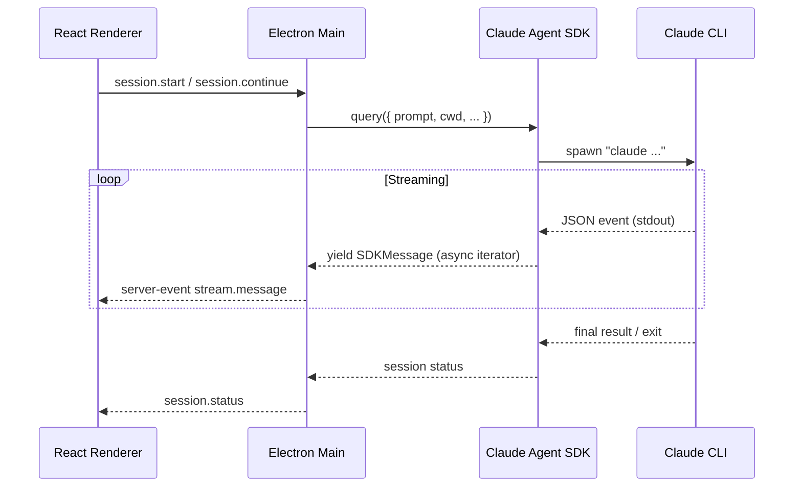
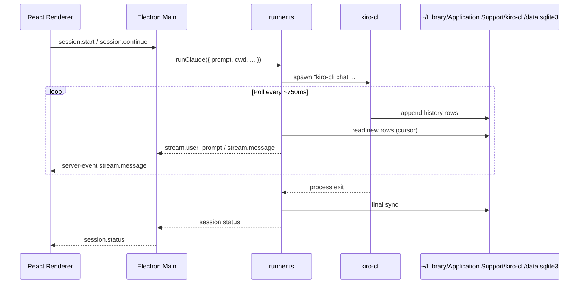

# Integration Comparison: Claude SDK vs Kiro CLI Polling

This project has supported two different backends for driving the CLI experience. The original version used the Claude Agent SDK (which streams events directly). The current version talks to Kiro CLI by watching its SQLite history. This document explains both schemes side by side.

## Claude Agent SDK (Streaming)

SDK parses CLI stdout and exposes it as an async iterator.
Main forwards each event to the renderer immediately.
CLI’s own `~/.claude` logs are written for its benefit, but the app never reads them.
No polling or intermediate storage required for live updates.

## Kiro CLI + SQLite Polling

No SDK. We read Kiro’s conversation log (`conversations_v2` table) directly.
Runner polls for new history entries, converts them into `StreamMessage`s, and forwards them over IPC.
Our own `sessions.db` mirrors the stream so history persists between app launches.

## Comparison Table

| Aspect                        | Claude Agent SDK (Legacy)                                | Kiro CLI Polling (Current)                                               |
|------------------------------|----------------------------------------------------------|---------------------------------------------------------------------------|
| Transport                    | SDK async iterator (streaming stdout)                    | Poll SQLite (`conversations_v2`) every ~750 ms                           |
| CLI dependency               | Claude Code CLI bundled inside SDK                       | Kiro CLI installed on system (/Applications or PATH)                     |
| Conversation storage         | `~/.claude` JSON logs (unused by app)                    | `~/Library/Application Support/kiro-cli/data.sqlite3` (read-only)        |
| App-local persistence        | `sessions.db` (session list + history mirror)            | Same `sessions.db`                                                       |
| Real-time updates            | Immediate via SDK events                                 | Near-real-time via polling                                               |
| Tool approvals               | SDK handled streaming AskUserQuestion events             | CLI auto-trust (`--trust-all-tools`); polling just mirrors final entries |
| Implementation complexity    | Simple (SDK provided parsed events)                      | Requires cursor tracking & SQLite parsing                               |
| Manual directory selection   | Allowed (user chose cwd)                                 | Disabled; each session gets auto-created workspace                       |
| Streaming fallback           | None needed                                              | If polling disabled, UI only updates after CLI exit                      |
| SDK usage                    | Yes (`@anthropic-ai/claude-agent-sdk`)                   | No (all integration code lives in `runner.ts` + SQLite poller)           |
| Log format                   | Multiple JSON events streamed via stdout                 | Single `conversations_v2` row per workspace with growing `history` array |
| Workspace selection          | User-selected via modal                                  | Auto-provisioned per session (uploads copy files into workspace)         |
| Why not use stdout?          | SDK already parsed structured events                     | Kiro CLI stdout is human-readable only, so we poll SQLite for structure  |

Both approaches share the same renderer + IPC plumbing; the main difference is where the “stream” originates (SDK vs. SQLite). The current Kiro integration relies on polling because Kiro CLI does not expose a streaming SDK yet.
